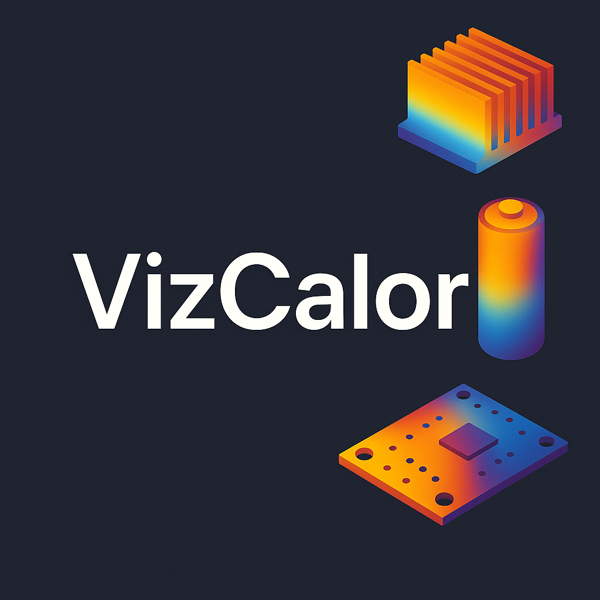
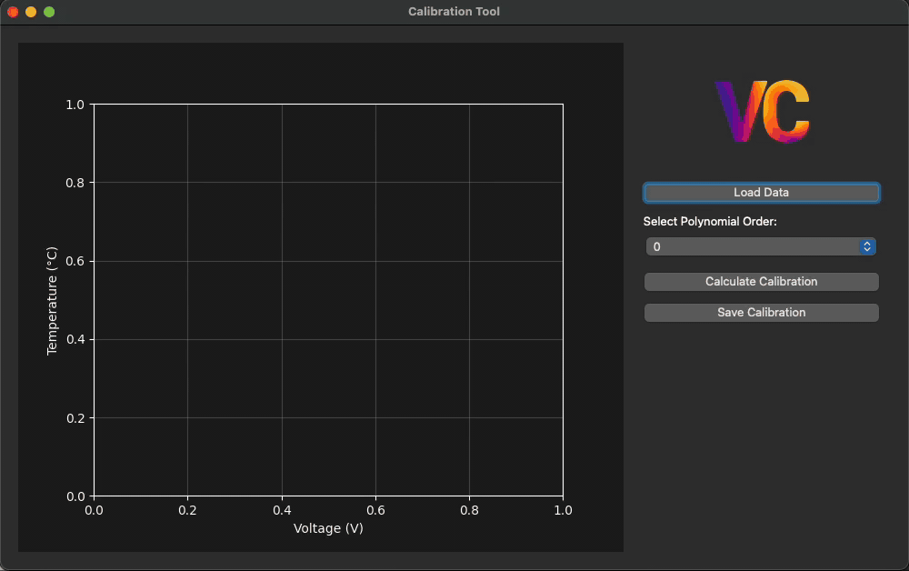

# VizCalor
Is a tool for visualizing and recording temperature data.

Provides a native support for DAQ tools (currently only supporting LabJack T7).

## Features

### Loading 3D models


### Placing Temperature Sensors on the object


### Supported multiple Data Sources

- LabJack T7
- Named Pipes (UNIX)
- Serial COM Ports
- Playback of recorded data

### Ability to load Calibration files and assign them


### Tool for calculating calibrations




## Installation

Currently in the form of python program. After cloning this repo:

```zsh
python -m vizcalor
source vizcalor/bin/activate
pip install -r requirements.txt
```

To run:

```zsh
python main.py
```

